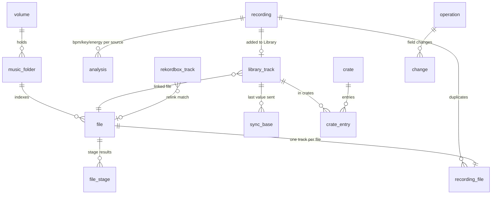

# Architecture overview

For an experienced developer who has never seen this project and has been asked to review its architecture. It describes what the code on `main` does today (2026-10-02, Stage 1aG of Phase 1a). Anything not built yet is marked *planned*, with its phase. The plan is in [ROADMAP.md](../ROADMAP.md), the rules for contributors in [CLAUDE.md](../CLAUDE.md), the task list in [TASKS.md](../TASKS.md).

The questions we most want answered are in [section 8](#8-questions-wed-like-a-reviewer-to-answer).

## 1. What the app is, and what it isn't

- A free desktop app (GPL-3.0-or-later; Tauri 2, Rust, React/TypeScript) for DJs who use rekordbox 7 on Windows.
- It indexes the user's music folders, read-only, and reads rekordbox's collection from its XML export.
- The user builds a **Library**: the tracks they play with. Each Library track points at a file that already exists.
- It writes one rekordbox XML file, which the user imports into rekordbox by hand ("a send").
- Everything is local: one SQLite database in the app data folder. Windows is the only supported platform.

What it deliberately is not (ROADMAP §1 principles; CLAUDE.md "Must / never"):

| It never | How that is held |
|---|---|
| Moves, renames, retags or deletes a file outside its own folders | The write guard (section 5) |
| Writes an audio file (in Phase 1) | No code path does; managed copies are *planned*, Phase 2 |
| Writes to rekordbox's database, gig USBs or OneLibrary, or reads its encrypted databases | Only the XML export is read; only one XML file is written |
| Syncs with one click | A send is a guided checklist; rekordbox's import is the user's |
| Makes a network request the user didn't opt into; sends telemetry | The network gate (section 5). Today no feature makes any request |
| Trusts a file's size or modified time as proof it's unchanged | Files are identified by a hash of their audio frames |
| Silently overwrites a field edited on both sides | *Planned*, Phase 1c (conflict review). Today the app edits no rekordbox field |
| Suggests something without a reason | The `Suggestion` type can't be built without one. Nothing produces suggestions yet |

## 2. The shape

```
┌──────────────────────────── webview (React) ────────────────────────────┐
│ routes/screens → hooks (TanStack Query) → generated bindings.ts          │
└───────────────┬──────────────────────────────────────▲──────────────────┘
        commands (Tauri IPC)                    events (job updates,
                │                               scanned files, volumes)
┌───────────────▼──────────────────────────────────────┴──────────────────┐
│ Rust: command functions → job queue (worker threads) → feature modules   │
│        │ reads: ReadPool (4 read-only conns)   │ writes: Writer (1 thread)│
└────────┼───────────────────────────────────────┼─────────────────────────┘
         ▼                                       ▼
   SQLite (WAL) in the app data folder     music folders, rekordbox export:
   + the one XML file a send writes        opened read-only
```

### Frontend (`src/`)

- **Routes.** TanStack Router, code-based (`src/app/router.tsx`). One route per workflow stage, all inside one shell (`src/shell`: sidebar, top bar, details panel, player bar): `/overview`, `/review`, `/all-music`, `/library`, `/crates`, plus `/after-send`. Stages are listed once in `src/shell/stages.ts`.
- **Screens today.** Overview (first-run steps, the rekordbox source, the send checklist), Review (only the Missing list), All music (a minimal list), Library, Crates, the after-send lists, Activity (background jobs). The full track browser, Review queues and conflict review are *planned* (1b, 1c).
- **Calling the backend.** `src/bindings.ts` is generated by `tauri-specta` from the Rust command list in `src-tauri/src/ipc.rs` (`cargo run --example export_bindings`). It's never hand-edited, and CI fails if it's out of date. Feature hooks wrap the commands in TanStack Query (`useQuery` / `useMutation`, e.g. `src/crates/useCrates.ts`) and invalidate query keys after a change.
- **State.** Server state lives in TanStack Query. Zustand holds UI state and the two streams that arrive as events (the activity store, the scanned-files store).
- **Events.** Three typed events: `JobUpdates`, `ScannedFiles`, `VolumesChanged`. The activity sync listens first, then fetches a snapshot, so no update is lost between the two.
- **Errors.** A command that can fail returns `Result<T, IpcError>`: an error *kind* plus parameters, never text (`src-tauri/src/ipc/error.rs`). The frontend turns the kind into words through the generated `ERROR_KEYS` table (`src/api/errors.ts`). The detail goes to stderr.
- **Numbers.** 64-bit integers cross IPC as TS `number`. Row ids are safe; anything that can pass 2^53 must cross as a string.
- **i18n.** Every UI string goes through `i18next`. One namespace file per feature in `src/locales/en/`. An ESLint rule (`eslint-rules/no-raw-jsx-strings.js`) forbids raw strings in JSX. `src/i18n/resources.gen.ts` is generated, so keys are type-checked.
- **Copy pipeline.** The owner approves all wording. Each string has a row in `src/locales/notes/<namespace>.json` (purpose, where it shows, approved or not). `npm run copy:check` (CI) fails if notes and locale files disagree; `copy:gate` fails while any string is unapproved (run at phase checkpoints, not in CI).
- **Theme.** CSS tokens only (`src/theme/tokens.css`); a test rejects hardcoded colors.

### Backend (`src-tauri/src/`)

`lib.rs` is the startup: make the write guard, open the writer (which applies migrations), open the read pool, start volume detection, the job queue and the folder watchers, then open the window. `ipc.rs` is the single list of commands and events.

| Module | Owns | May not |
|---|---|---|
| `write_guard` | The only writable file handles, create/rename/delete, and every SQLite open | Allow a path outside its roots (today: the app data folder) |
| `db` | The one writer thread, the read pool, migrations | Hold a global `Mutex<Connection>`; edit an applied migration |
| `jobs` | The persisted job queue, worker threads, progress events, cancel | Run on the writer thread |
| `ops` | The operation log and undo | Record a table it can't restore exactly |
| `net` | The only HTTP client (`ureq`), per-service opt-in, rate limits, window navigation guard | Send anything without an opt-in. No module calls it yet |
| `ipc` | Command and event lists, bindings export, `IpcError` | Return error text |
| `settings` | Key/value settings as JSON in `setting` | Fail on an unknown value (reads as the default) |
| `volume` | Volume identity (serial-first), drive detection | Identify a drive by its letter |
| `paths` | Stored paths: volume + relative path, on-disk spelling and an NFC match key; `\\?\` paths | Touch the database |
| `scan` | Music folders, the walk (stat only), the unchanged check, watchers, the stage chain | Open a file for writing; read an online-only file unasked |
| `scan_state` | `file_stage`: which files each stage still has to do | Mark an unreachable file as failed |
| `sniff` | Format detection from bytes | Read the audio itself |
| `tags` | Lenient tag reading, key normalization | Write tags (*planned*, Phase 2) |
| `read` | Scan stage 2: tags, format, codec, duration, truncated/broken | Take file facts from rekordbox |
| `hash` | `blake3`, `audio_hash` (audio frames only), `partial_hash` | — |
| `fingerprint` | Chromaprint fingerprints, streamed decode, the shared thread budget | Hold a whole track in memory |
| `grouping` | File → track (`recording`). Today: same `audio_hash` = same track | Merge files with no hash. Fingerprint and version grouping are *planned*, 1b |
| `rekordbox` | The XML parser, `Location` decoding, the `rekordbox_track` snapshot, the export source and its watch | Write anything but the snapshot; match by TrackID |
| `relink` | Matching each rekordbox entry to a file, five rule steps, confirmed relinks | Open a file; match on size; trust a weak match |
| `attach` | rekordbox's BPM and key → `analysis` rows | Use a probable match |
| `library` | Library tracks: add (`promote`), remove, list | Re-point an existing link; touch a file |
| `start` | The offer to add rekordbox's tracks, whole or by playlist | Add anything automatically |
| `all_music` | The list of every track with a file | — |
| `missing` | rekordbox entries with no file, grouped by folder | Open a file or wake a network path |
| `fragile` | Warnings for files in Downloads, temp, external or network drives | — |
| `crates` | Top-level static crates and their entries | Accept a name the XML writer would refuse |
| `send_values` | Per track, every XML attribute to send and where it came from | Write anything |
| `rekordbox_write` | Building the XML bytes, the writer rules, `record_send` | Decide a track's values; write analysis fields |
| `send` | The send flow: prepare job, preflight, write job, the fixed output file | Use an old read; outlive the app run |
| `after_send` | The two lists after a send: stale playlists, manual removals | Write a file |
| `suggest` | The `Suggestion` type: a reason is mandatory | Be built without a reason |

## 3. The data model

SQLite, `STRICT` tables, 15 append-only migrations in `src-tauri/migrations/`. Many rules are enforced by `CHECK`s and triggers, and each has a test.



**Track identity, in three layers** (ROADMAP §2):

1. **`file`**: one row per physical file. Its path is a volume identity plus a relative path, stored twice: the exact on-disk spelling (to open it) and an NFC key (to compare). It carries `audio_hash`, which covers only the audio frames. *Why:* rekordbox rewrites tags and bumps modified times, so size, mtime and whole-file hashes all change while the music doesn't. A file that vanishes is marked `present = 0`, never deleted. A file on an unplugged drive stays present.
2. **`recording`** (a "track"): one piece of music in one version. `recording_file` links it to its files (role `best` / `undecided` / `extra`). *Why:* a track is not a file; duplicates merge, and resolving them changes only the database. **Versions never merge**: `version_link` only links them, and a trigger refuses to put linked versions in one track. Today `grouping` merges only files with the same `audio_hash`, and nothing creates version links yet (*planned*, 1b).
3. **`library_track`**: a track the user added. Always `kind = 'linked'` in Phase 1 (a trigger enforces it): it points at `linked_file_id`. `source_status` (ok / missing) follows the file's `present` flag through triggers. One Library track per track.

The other main tables:

| Table | What it is | Why it's shaped that way |
|---|---|---|
| `analysis` | BPM, key, energy: one row per track per source | The source of truth. The shown value comes from the `recording_display` view by fixed precedence, so it can't drift or be edited. Today only `attach` writes rows (source `rekordbox`) |
| `rekordbox_track` | A read-only snapshot of rekordbox's collection, replaced on every read. Every XML attribute kept as read (JSON), plus the relink result | The writer must send every attribute back unchanged. TrackID is only valid within one read; tracks are matched by decoded `Location` |
| `relink` | A relink the user confirmed, keyed by Location key, with the file's `audio_hash` then | Survives snapshot replacement; downgraded to "probable" if the file's audio changes |
| `file_stage` | Per file and stage (read / hash / fingerprint): size, mtime, stage version, outcome | A stage redoes only changed files; bumping a version redoes all |
| `sync_base` | Per Library track and XML attribute: the text last sent | For the three-way compare (*planned*, 1c). Written by every send; nothing reads it yet |
| `conflict` | The review queue for fields changed on both sides | *Planned*, 1c. A trigger already refuses analysis fields |
| `crate`, `crate_entry` | A tree of folders and crates; entries are Library tracks | Only top-level static crates can be made today |
| `sent_playlist` | Every folder and playlist path a send has written, and whether a read has seen it in rekordbox | Tells what the app put in rekordbox from what the user made there |
| `library_removal` | Tracks the user removed from the Library | Keeps them out of the rekordbox offer; lists them for removal in rekordbox |
| `operation`, `change` | The undo log: one operation, one `change` per field (`set` / `insert` / `delete`, before, after) | Generic over tables; stores a kind and JSON details, never UI text |
| `job` | Background work: kind, JSON target, priority, status, progress | Persisted so the queue survives a restart |
| `setting`, `service_optin` | Key/value JSON; per-service network opt-in | The network gate reads `service_optin` |

The canonical tag columns on `recording` (title, artist, …) exist but nothing fills them yet. Lists show titles from what a send would write (rekordbox's values, else file tags); that task (1aG-9) is still open.

## 4. The flows

### Scan
1. `scan::folders::add_music_folder` stores a folder as volume + relative path. `scan::scan_music_folders` queues a **Scan** job.
2. `scan::walk` lists audio files with stat only (size, mtime, NTFS file id) into `file` rows, in batches, and emits `ScannedFiles`. The unchanged check (`scan::unchanged`) compares a stored `partial_hash` when only the mtime moved. A file not found in a folder the walk could list becomes `present = 0`.
3. `scan::chain` wraps each handler so one stage queues the next, at background priority: walk → **Read** (`read`, using `sniff` and `tags`) → **Hash** (`hash`) → **Group** (`grouping`) and **Fingerprint** (`fingerprint`).
4. Each stage asks `scan_state` which files are due and writes results plus its `file_stage` rows in one transaction per batch.
5. A finished read, a finished fingerprint run and every grouping run ask for a **Relink**; relink and grouping ask for an **Attach**.
6. `scan::watch` (optional per folder) turns bursts of file events into one rescan of the root. Every online folder is also rescanned at startup and when its drive returns.

### Read the rekordbox export
1. The user exports the collection from rekordbox and picks the file (`rekordbox::source::read_rekordbox_xml`), which queues a **ReadRekordbox** job.
2. `rekordbox::reader` streams the XML. A bad value clears one field; a file that isn't well-formed is refused whole. A track count that disagrees with `Entries` marks the read incomplete.
3. `rekordbox::store` builds the rows off the writer thread, then replaces the `rekordbox_track` snapshot in one transaction, with the last-read record and the playlist tree (`after_send::save_tree`).
4. A relink is requested.

### Relink and attach
1. **Relink** job (`relink::relink`, rules in `relink::rules`) loads every present file and every snapshot row and decides every row from scratch, inside one writer call.
2. Steps, each over all rows before the next: confirmed relinks; path; file name + duration; unique duration in a candidate folder set; audio hash or fingerprint of a file that has gone; file name only.
3. A match is made only when the evidence picks exactly one file. Weak matches are stored as `relink_probable = 1`: the file is taken, but no rekordbox data is trusted until the user confirms (the Review UI for that is *planned*, 1b).
4. **Attach** job (`attach`) writes rekordbox's BPM and key to `analysis` for trusted matches only. All other rekordbox data is read from the snapshot when needed.

### Starting a Library
- **From rekordbox:** `start::rekordbox_offer` counts tracks with a trusted match that aren't in the Library. `start::add_rekordbox_tracks` adds them (all, or by chosen playlists) as one operation, so one undo removes the batch.
- **Fresh:** `all_music::all_music_tracks` lists tracks; `library::promote_track` adds one.
- Either way `library` picks the linked file: the file rekordbox uses (trusted match), else the track's best file. It refuses if that file isn't on disk. Only database rows change.
- `library::remove_library_track` deletes the track with its crate entries and sync bases, and adds a `library_removal` row, in one undoable operation.

### Crates
`crates::create_crate`, `rename_crate`, `delete_crate`, `add_tracks_to_crate`, `remove_tracks_from_crate`. Each is one recorded operation. Names are compared the way the XML writer compares siblings (NFC, case and trailing whitespace ignored), so a crate the app accepts can't make a send fail.

### The send
1. **Prepare.** `send::prepare_send` queues an **Export** job (target `send: prepare`, user priority, tagged with this app run's id).
2. The job reads the export again, always (`rekordbox::source::XmlReader`). Then, in **one** writer call, it runs `relink::relink` and builds the preflight (`send::preflight::review`), so no other read can land in between.
3. `rekordbox_write::gather` collects the input. `send_values` decides each track's attributes: for a track rekordbox knows, rekordbox's own values, string for string; for a new one, tag values and file facts. `rekordbox_write::build` produces the bytes under the writer rules (never analysis fields; `Location` percent-encoded; exactly two top folders, `Crates` and `Playlists`), then reads them back with the app's own parser and refuses on any difference.
4. **Preflight.** Kept in memory in `send::SendFlow` with a token. `send::send_state` shows it: new and known track counts, tracks left out and why, crates that lose entries, whether a confirm is needed, or why the send is refused.
5. **Write.** `send::write_send(token, confirmed)` queues a second Export job. It rebuilds the send and refuses unless the token matches, the export file's modified time is unchanged, and the snapshot is from the same read.
6. `send::file::write_and_record` clears leftovers of a crashed send, writes `tracklist-pro.xml` in the app data folder via `WriteGuard::write_then_rename`, then calls `rekordbox_write::record_send`.
7. **Record.** One transaction: `sync_base` for every field sent, `last_sent_location` and `last_exported_at` on each Library track, and the `sent_playlist` paths. If recording fails, the previous file's bytes are put back.
8. The user imports the file in rekordbox by hand. A send is not in the operation log.

### After-send lists
`after_send::commands::after_send_lists` computes two lists from the database alone: **stale playlists** (paths the app sent, a read has seen in rekordbox, and the app's tree no longer has) and **manual removals** (removed Library tracks rekordbox still holds). An XML import can't delete either, so the user does.

### Undo
1. Every user-facing change runs through `ops::record`: a `Recorder` makes each write and its `change` rows in the same transaction.
2. The recorder refuses a delete that would cascade to rows it didn't record.
3. `ops::undo_last_operation` reverses the newest operation, but first checks every field still holds what the operation left. If anything changed since, it changes nothing and reports the conflict.
4. Scans, reads, relink, attach and sends are not operations.

## 5. The safety architecture

**"No bytes outside the app data folder."** The app's own code creates, changes, renames or deletes files only under `%APPDATA%\com.tracklistpro.desktop\`: the database (with its WAL files) and the one XML file. Music folders and the rekordbox export are only ever opened for reading. The WebView2 profile under `%LOCALAPPDATA%` is written by the runtime, not app code. The Library folder becomes a second root in Phase 2 (*planned*).

| Mechanism | What it does | How tests hold it |
|---|---|---|
| **Write guard** (`write_guard`) | The only source of writable handles. Resolves `..`, symlinks and junctions before checking a path is inside a root; refuses hard-linked files; opens every SQLite connection and blocks `ATTACH` and `VACUUM INTO`; `temp_store = MEMORY` | `write_guard/scan.rs`: a source scan fails on any writing API (or process spawn) outside the guard, with a short list of reasoned exemptions. `write_guard/no_writes_elsewhere.rs`: runs startup and the read paths in a sandbox and checks no other file's bytes or times changed |
| **Atomic output** | `write_then_rename`: new file beside the destination, flushed, renamed over it; leftovers cleared before the next send | Send tests inject write and record failures |
| **Network gate** (`net`) | One private `ureq` client. Every request names a service; no opt-in means no connection, not even DNS. HTTPS only, no redirects, per-service rate limit | `tests/net_gate.rs`: scans source, `Cargo.toml` and `Cargo.lock` for any other network or shell-open path; each check also runs on a planted violation |
| **Webview** | Strict CSP; the window refuses to navigate off the app's origin or open windows; `Object.prototype` is frozen | `tests/csp.rs`, `tests/freeze_prototype.rs`, `src/test/noNetworkCalls.test.ts` |
| **Single writer** (`db::Writer`) | One thread owns the write connection; callers send closures over a channel. A closure is one transaction. Calling the writer from inside itself returns `DbError::Reentrant` instead of deadlocking | Writer tests; pragma tests (WAL, `synchronous = NORMAL`, 5 s busy timeout, foreign keys on) |
| **Read pool** (`db::ReadPool`) | 4 read-only connections, also `query_only` | Pool tests |
| **Job queue** (`jobs`) | Jobs are rows in `job`. 2–4 worker threads take the highest priority first. One lock orders enqueue, claim, progress, finish and cancel, so the table, the in-memory list and the event sequence agree. Updates are batched (newest per job) on one dispatch thread. On exit, running jobs are asked to stop and go back in the queue | `jobs/tests.rs`; IPC tests in `lib.rs` |
| **Migrations** | Append-only; each in its own transaction with a foreign-key check; the app refuses a database whose recorded checksums differ | `checksums.txt` test, plus a CI script that a PR only adds migrations |
| **Suggestions** | Private fields; the constructor, deserializer and serializer all require a reason | Unit tests and a `compile_fail` doctest |

Worth knowing: several jobs do their whole computation **inside one writer call** (relink, grouping, attach, and the send's relink + preflight). That is deliberate (atomic, no interleaving) but it blocks every other write while it runs. Relink caps fingerprint comparisons at 20,000 pairs per run for this reason.

## 6. Testing and CI

The owner doesn't line-read Rust, so the rule is "tests are the review": every task ships with tests for its behavior and for each must/never rule it touches.

| Kind | Where | Notes |
|---|---|---|
| Unit | `tests.rs` beside each module | Rule modules (`relink::rules`, `grouping::plan`) are pure functions over loaded data |
| Migration and schema | `db/migrations/schema/`, `append_only.rs` | Each constraint is shown to refuse and accept the right rows |
| Safety gates | `write_guard/scan.rs`, `no_writes_elsewhere.rs`, `tests/net_gate.rs`, `tests/csp.rs` | Described above |
| IPC | `lib.rs`, `ipc.rs` | Real startup on Tauri's mock runtime; commands called as the webview calls them; bindings export is deterministic |
| End to end | `src-tauri/tests/end_to_end/` | Real startup, real commands, real job queue, generated music and a generated export. Two runs: start from rekordbox, and start fresh. A stand-in for rekordbox's import follows ROADMAP §5.2 only. Every run ends by checking nothing outside the app data folder changed. The React frontend isn't loaded |
| Scale (ignored by default) | `tests/perf_100k.rs`, `rekordbox_xml_scale.rs`, `fingerprint_memory.rs` | 100k generated files; a 50k-track export; a two-hour mix with flat memory |
| Frontend | Vitest + Testing Library, beside each component | Tests never spell out UI text: they look it up by key with `tx("namespace:key")` |
| Marker run | `npm run test:markers` | Reruns the frontend suite with every UI string replaced by a marker, proving no test depends on wording |
| Scripts | `node --test` | The copy pipeline and the CI scripts have their own tests |

Fixtures are generated (`tools/fixture-gen`); CI never depends on a real library.

**CI** (`.github/workflows/ci-windows.yml`, on every PR and push to `main`): a changed-paths job decides what runs (a docs-only change builds nothing). On Windows: `cargo test`, a debug compile of the whole app, the bindings-are-current check, `clippy -D warnings`. On Linux: `cargo fmt --check`, the append-only migration check, frontend build, lint, `copy:check`, tests, the marker run, `cargo-deny` (licenses, advisories, bans, sources) and an npm license check. A final **CI result** job is the one required check. macOS and Linux builds with platform-neutral tests run weekly (`ci-macos-linux.yml`).

**Not covered by automation:** rekordbox's real import behavior. It's checked by hand with the kit in `spikes/rb-kit` (last on rekordbox 7.2.19), and by the owner's real send cycles, which are still open (`DOGFOOD.md` is empty).

## 7. Known limits and accepted risks

- **rekordbox's import behavior is observed, not documented** (ROADMAP §5.2). Any 7.x update can change it. Three cases are explicitly unverified: same-name playlists differing only in case or Unicode form; re-sending a track whose `Location` is not a plain drive path; the `Kind` string for MP4 files.
- **A "Yes" in rekordbox's import dialog is a full overwrite and can't be undone by the app.** Values come from the export read at prepare time; edits made in rekordbox after that export are lost.
- **Stale playlists are matched by name only.** A user-made playlist with the same name and place as an app crate that was sent but never imported can be listed for deletion (`after_send` module docs).
- **Single-step undo.** Only the newest operation can be undone. Multi-step is *planned* (1b).
- **Sends aren't operations.** A send's new `sync_base` rows can reuse row ids of a removed track's rows; undoing that removal is then refused.
- **A crash between writing the XML and recording the send** leaves an unrecorded file. Nothing detects it at the next start; the next send replaces it.
- **Crash resume for jobs is *planned* (1c).** A clean exit re-queues running jobs; a hard kill leaves rows in `running`.
- **No conflict detection yet** (*planned*, 1c). Safe today only because the app changes no field of a track rekordbox knows.
- **Grouping is by exact audio hash.** Re-encodes aren't grouped; versions aren't detected (*planned*, 1b).
- **Partial-hash blind spot:** a same-length edit in the middle of the audio with an mtime-only change isn't noticed.
- **Path relink can be wrong** when a file was replaced by other audio under the same name, or an unplugged drive shared a letter (confidence 0.9).
- **Unknown durations block relink steps** for that name and folder, for good if the file is broken or online-only.
- **Opus files get no fingerprint** (not among the decoder's codecs).
- **An NVMe drive in a Thunderbolt enclosure reports as internal**, so it gets no fragile-location warning.
- **One DJ app, one OS.** rekordbox 7 XML and Windows path rules run through `rekordbox`, `rekordbox_write`, `send_values`, `relink`, `paths` and the schema (`rekordbox_track`, `sync_base.field` = XML attribute name).
- **Unsigned builds, no updater yet** (*planned*, Phase 4).

## 8. Questions we'd like a reviewer to answer

1. **Single writer, long closures.** Relink, grouping, attach and the send's relink + preflight each run whole inside one `Writer::call`. At 100k files and a 50k-track collection, relink loads every present file and every snapshot row and plans in memory while all other writes wait. Is "atomic by being one closure" the right trade, or should these read on a pool connection, plan off-thread and apply with a staleness check?
2. **Relink redecides every row on every run**, and runs after every read stage, fingerprint run, grouping run and rekordbox read. That makes results independent of history, but the cost is O(collection) each time. Is there an incremental form that keeps the "same input, same output" guarantee?
3. **The job chain is implicit.** Stages queue each other through handler wrappers plus in-memory "run once more" state (`scan::chain`), and relink/attach have their own request rules. Is there a loop, a lost wake-up or a starvation case we've missed? Would an explicit dependency graph be safer than conventions?
4. **Rows left `running` after a hard kill.** As we read `scan::chain::queue_once`, a `running` row with the same kind and target counts as active, so a scan stage for that folder would not be queued again until crash resume exists (1c). Is that right, and should startup reset such rows now?
5. **The operation log is generic and field-level** (`entity`, `entity_id`, `field`, before/after as text), with undo refusing on any later change. It breaks when row ids are reused (the send vs removal case). Is row-id identity sound for a log meant to become multi-step, or should logged tables use ids that are never reused (`AUTOINCREMENT`) or operation-specific inverses?
6. **What is and isn't undoable.** Sends, reads, relink and attach bypass the log and may change rows an operation touched. Is the boundary coherent, or will multi-step undo meet states it can't restore?
7. **The XML round trip rests on "every attribute as read, string for string"**, stored as JSON per track and re-emitted. The send is verified by re-parsing with our own reader, which shares our own assumptions about escaping, attribute order and `Location`. What independent check would catch a bug both sides share?
8. **The send's consistency model**: an in-memory preflight, a token, the export's modified time and the snapshot's `read_at`. Is mtime a good enough "export unchanged" check? Is the file-then-record order (with byte restore on failure) right, or should the record come first with a pending flag?
9. **`sync_base` is keyed by XML attribute name and holds the sent text**, and `Location` must be compared by decoded key, not text. Three-way merge (1c) will be built on it. Is a rekordbox-specific, text-typed base the right foundation, given a second DJ app is a stated later goal?
10. **Track identity when grouping changes.** `library_track`, crate entries, `sync_base` and `rekordbox_track.recording_id` all hang off `recording`, and 1b will replace hash grouping with fingerprint + version grouping that merges and splits tracks. What breaks when a recording the user has in the Library is merged or split?
11. **Schema-enforced rules.** Many invariants live in triggers and `CHECK`s (versions never merge, linked-only in Phase 1, status follows file). Some are phase-specific and must be replaced by table rebuilds under append-only migrations. Is that sustainable, or should phase rules live in code?
12. **Scale.** Besides the single writer: per-track JSON attribute blobs in `rekordbox_track`, `raw_tags` JSON per file, list commands that return whole lists to the webview (no paging or virtualization yet), and a full-root rescan per watcher burst. Which of these hurts first at 100k tracks?

## 9. Open points

Places where the docs and the code disagree, or that we couldn't verify.

- **ROADMAP "Status" is stale.** It says the next step is Stage 0F; TASKS.md and the code are at Stage 1aG.
- **ROADMAP 0.1 vs §5.6 on the write guard.** 0.1 says "only the Library module gets a writable file handle". The code (and §5.6) have a separate `write_guard` module scoped to the app data folder; `library` writes no files.
- **ROADMAP 0.1 job kinds.** It lists nine; the code has twelve (`group`, `relink`, `attach` added). `analyze`, `embed` and `convert` have no handler yet.
- **ROADMAP 1.9 rule 2 (read → merge → send).** The merge step doesn't exist yet (1.10 is Phase 1c). The send does read first.
- **ROADMAP 1.9 rule 4 says a send "may carry only the playlists and crates that changed".** The code always passes the whole crate tree; we found no changed-only path.
- **ROADMAP §2 `analysis` precedence** lists tag, MIK, user, local and ML sources. Only `rekordbox` rows are written today; file-tag BPM and key are read by `tags` but not stored in `analysis`.
- **`recording` canonical tags and provenance** are in the schema and ROADMAP §2, but no code fills them. Task 1aG-9 (titles in lists) is unchecked in TASKS.md; we didn't verify how far the list code already goes.
- **Crate name uniqueness.** The schema's unique index compares names exactly; the `crates` module compares by the writer's sibling key. They agree only because every write goes through the module.
- **Job rows left `running` after a hard kill** (question 4): read from the code, not reproduced.
- **README** says the app "finds duplicate files and related versions". Today only exact-audio duplicates are grouped; versions are planned (1b).
- **Not verified here:** rekordbox's real import behavior (the manual check kit), and the measured performance figures quoted in ROADMAP 1.1.
